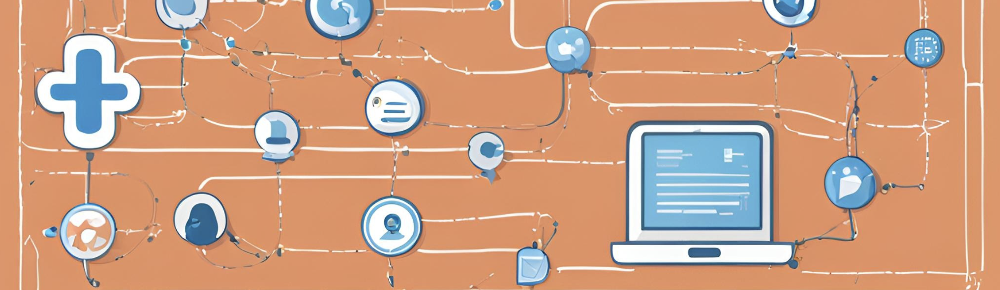
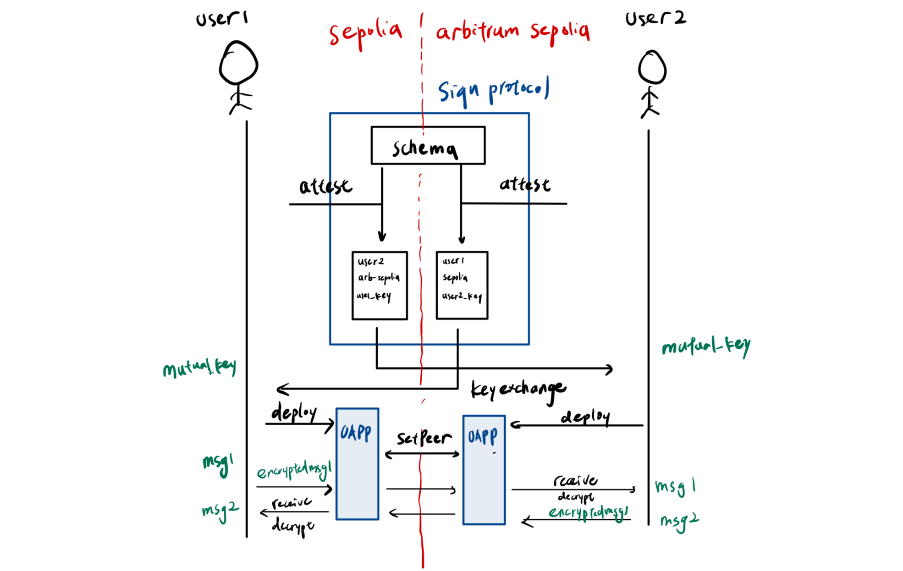

# Xmes

Welcome to **Xmes**! 🚀

Xmes is a project integrates LayerZero OAPP and Sign Protocol to create a decentralized omni-chain messaging platform. The platform enables users to send and receive messages peer-to-peer across multiple blockchains, ensuring secure communication between different chains.

## Overview
- **Peer-to-Peer Communication**: Engage in private, encrypted conversations with friends and peers using our chatroom feature.
- **Sign Protocol**: We use sign protocol attestation as friend request and ECDH key exchange.
- **LayerZero**: We use LayerZero OApp to set up peer yo peer communication between different chain.

## How It Works


1. **Connect Wallet**
   User connects to his wallet and select network
2. **Send Friend Request**: 
   User type in friend's adddress and the chain the friend is on, the app will then generate a key to do ECDH key exchange, and deploy an OApp contract for user. Then it packs it into the attestation to Sign Protocol.
3. **Check Friend Status**: 
   This step is to check that user have already attest friend as friend, and the friend has attest user as friend. If one of them does not attest the other, they cannot send message.
4. **Initialize Chat Room**:
   This step is to setPeer to the Oapp contract of the two users, and calculate the shared key between them.
5. **Send Message**:
    Once user send a message, the app encrypts it with shared key and send it to the Oapp contract of this side and by LayerZero it sends to the other side.

## Getting Started

To get started with Xmes, follow these steps:

1. **Install Dependencies**: 
```
yarn install
```
1. **Open frontend**: 
```
yarn frontend
```   
you can do it twice to mock 2 person sending message to each other

## Sign protocol Schema
Sign protocol Schema has already been deployed, we currently support two networks:
```
"sepolia": "0x157",
"arbitrum sepolia": "0xd7",
```   

## Networks
we currently support two networks, and can be more depends on mutual supported networks between Sign protocol and LayerZero.
```
sepolia
arbitrum-sepolia
```

## Further work
1. Add more networks.
2. Add messaging between users on same chain
3. Connect users as an OFT ERC6551 to have a more extensive onchain identity
4. Listen to events from contract so that app can automatically refresh chat history
5. Add more function to this chatroom, ex. OFT transfer, bot.

